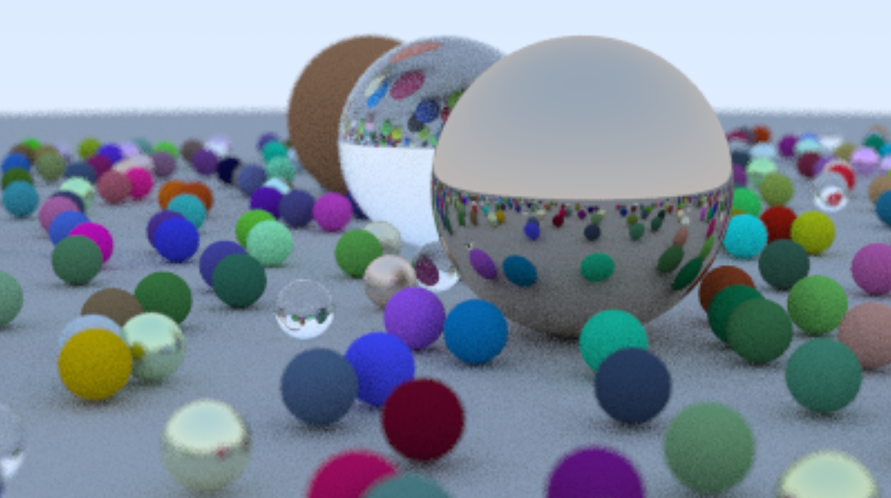
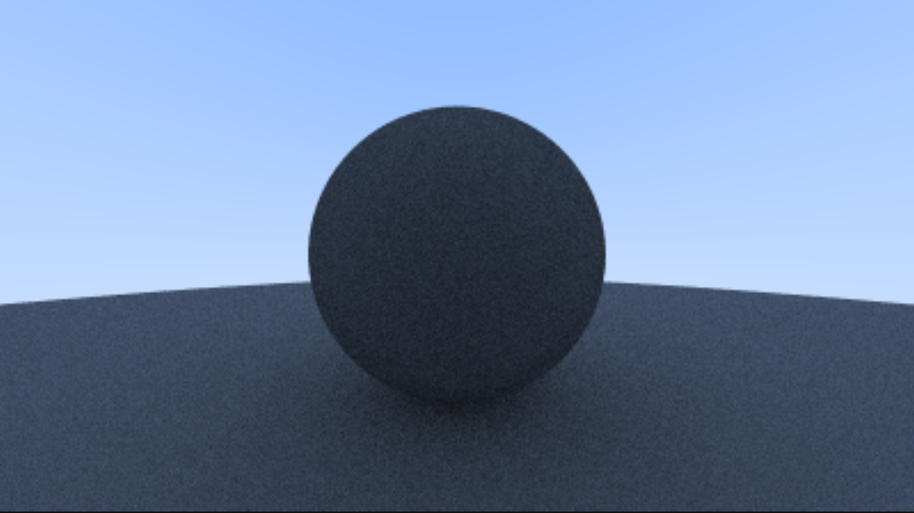
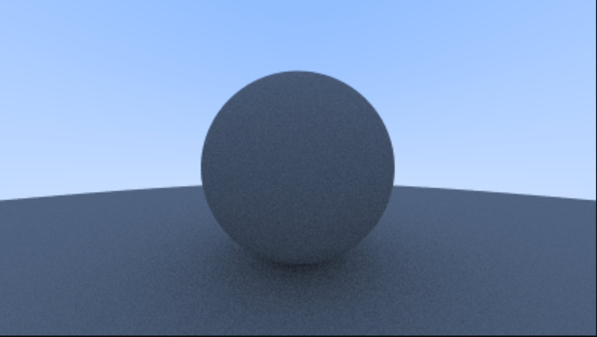

# Raytracing In One Weekend

- [https://raytracing.github.io/books/RayTracingInOneWeekend.html#overview](https://raytracing.github.io/books/RayTracingInOneWeekend.html#overview)
- [https://www.cs.rhodes.edu/welshc/COMP141_F16/ppmReader.html](https://www.cs.rhodes.edu/welshc/COMP141_F16/ppmReader.html)

_Render used lower values across the board so it wouldn't take to long to generate_!

## Personal Notes

- **None**

## How to build for debug

- rm -r build (if the build doesn't finish)
- cmake -B build
- cmake --build build
- build\Debug\raytracing.exe > image.ppm

## On shadow acne

### The Problem Restated

When a ray hits a surface, the intersection point is calculated using floating-point arithmetic, which is not perfectly precise. As a result, the calculated intersection point may be slightly "off" — either a tiny bit above or below the surface. If the next ray originates from this slightly "off" point and goes towards the light source or another surface, it might erroneously register a hit on the same surface due to being too close. This causes self-intersection, which can lead to shadow acne or incorrect ray bounces.

### The Solution (Ignoring Very Close Hits)

To solve this, the book suggests a practical hack: ignore intersections that are too close to the calculated hit point. The idea is to define a small threshold or bias (commonly called an "epsilon") that prevents the new ray from interacting with the same surface it just hit.

In code t is the parameter describing the distance along the ray where the intersection occurs. t_min is a small positive value (e.g., 0.001) to exclude hits that are extremely close to the surface. t_max is the upper limit for valid intersections. By setting t_min to a small value (instead of 0), you effectively "push" the origin of the new ray slightly off the surface, ensuring it doesn't intersect the same surface again.

### Why This Works

Ensuring that the next ray starts just slightly above the surface. Ignoring any intersections that occur below this threshold (which would typically be self-intersections).

### Drawbacks of This Hack

- **Bias:**
  - If t_min is too small, the problem might persist for very flat surfaces or surfaces with sharp edges.
  - If t_min is too large, it could cause small gaps or artifacts in your render where surfaces should touch.

- **Performance:**  
  Every ray-tracing calculation now includes an additional condition to check (t_min).

- **Accuracy:**  
  This is a hack, not a physically accurate fix. A more robust solution would involve improving precision or using higher-resolution intersection tests, but these are computationally expensive.

### Takeaway

Ignoring hits very close to the surface is an easy and practical solution to the shadow acne problem. It trades physical accuracy for computational efficiency, which is often a good compromise in rendering. However, for high-quality renders or specific scenarios, you may need to tweak the bias or explore alternative solutions.
